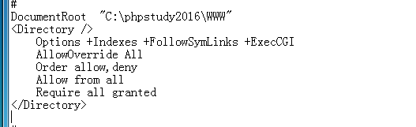
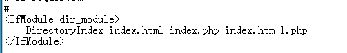
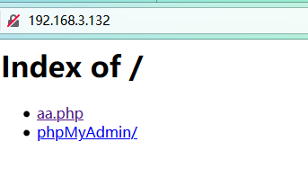
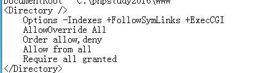

# 目录遍历

漏洞出现原因：Apache中httpd.conf配置错误导致

原理：当客户端访问到一个目录时，Apache服务器将会默认寻找一个index list（DirectoryIndex参数）中的文件，若文件不存在，则会列出当前目录下所有文件或返回403状态码，而列出目录下所有文件的行为称为目录遍历。

复现过程：

```
Options +Indexs...
+代表允许目录浏览 
–代表禁止目录浏览
```




默认访问的文件




如果访问目录下没有默认访问的文件，就会列出所有文件



修改Indexs前面为减号



重启服务器并访问


**修改了服务器配置文件都要重启服务器才能生效**