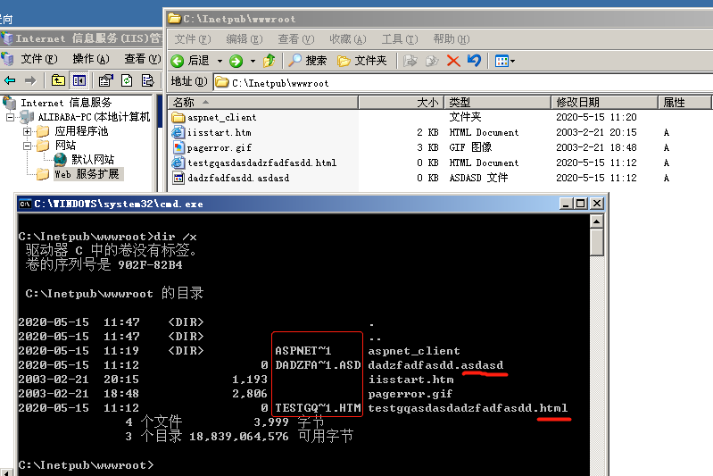
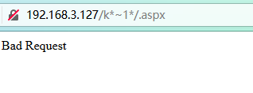
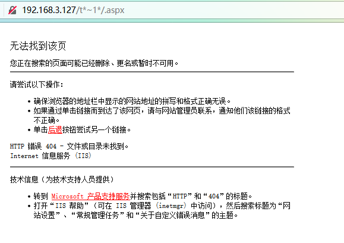
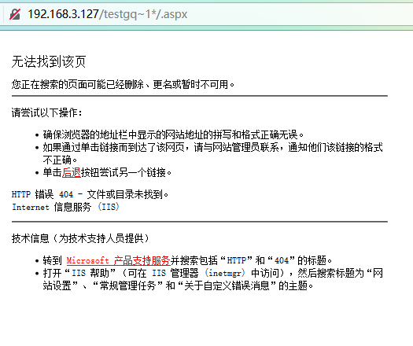
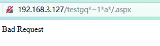
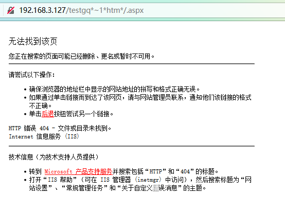
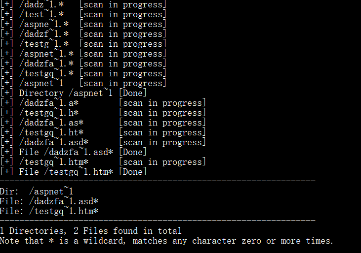

# IIS 短文件(夹)名猜解

### 前提

1. IIS
2. ASP.NET

### 短文件规则

1. 只保留前六位，后续用~1表示
2. 全部为大写
3. 后缀最多显示三位，其余被截断
4. 长文件名前缀或文件夹名字符长度符合0-9和Aa-Zz范围且需要大于等于9位才会生成短文件名，如果包含空格或者其他部分特殊字符，不论长度均会生成短文件

### 漏洞原理

为了兼容16位MS-DOS程序，Windows为文件名较长的文件（和文件夹）生成了对应的windows 8.3 短文件名。

在Windows下查看对应的短文件名，可以使用命令

```windows
dir /x
```




#### 根据HTTP的响应区分一个存在或不存在的文件：

访问构造的某个**存在**的短文件名，会返回**404**

访问构造的某个**不存在**的短文件名，会返回**400**

### 漏洞危害

1. 猜解后台地址和目录
2. 猜解敏感文件，如sql，bak等文件

### 漏洞复现

使用通配符*，用于匹配0-n个字符，所以一个\*等同于\*\*\*\*

构造通用payload

```payload
ip/要匹配的短文件名/.aspx
```

1. 访问 192.168.3.127/k\*~1\*/.aspx

   返回400 Bad Request，说明不存在k开头的文件

   

2. 访问 192.168.3.127/t\*~1\*/.aspx  

   返回404，说明存在 t 开头的文件



3. 继续猜解 t 开头的短文名，依次在 t 后面尝试Aa-Zz0-9等字符，最多只能猜解六位



4. 短文件名猜解完，开始猜解后缀，后缀最多猜解三位，其余被截断

访问 192.168.3.127/testgq\*~1\*a\*/.aspx

返回Bad Request，后缀名不是 a 开头



5. 依次尝试其他字符

访问192.168.3.127/testgq\*~1\*htm\*/.aspx

返回404，说明后缀为htm，即html文件



6. 脚本暴力猜解演示



### 漏洞修复

1. 升级.net framework至4.0+版本

2. 修改注册表键值：

   ```register
   HKEY_LOCAL_MACHINE\SYSTEM\CurrentControlSet\Control\FileSystem
   
   修改NtfsDisable8dot3NameCreation为1
   表示不生成短文件名，重启生效。
   ```


