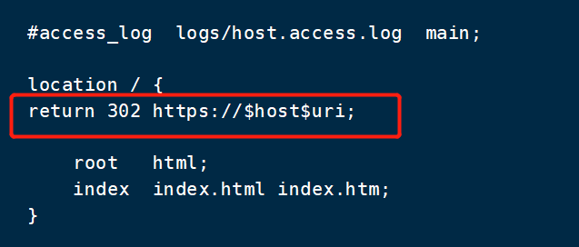
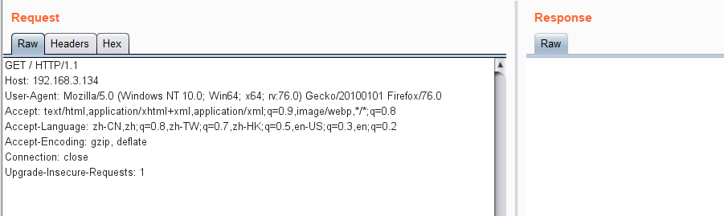
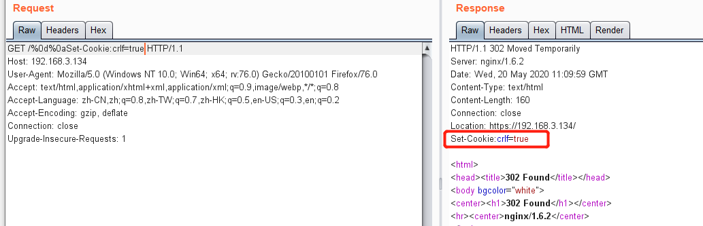

# CRLF注入

CRLF 指的是"回车 + 换行"的简称

**回车符**(CR，ASCII 13，\r，%0d) ,光标移到行首

**换行符**(LF，ASCII 10，\n，%0a),光标垂直移到下行


**原理**

CRLF注入漏洞，是因为Web应用没有对用户输入做严格验证，导致攻击者可以输入一些恶意字符。攻击者一旦向请求行或首部中的字段注入恶意的CRLF，就能注入一些首部字段或报文主体，并在响应中输出。

CRLF注入漏洞的检测也和XSS漏洞的检测差不多。通过修改HTTP参数或URL，注入恶意的CRLF，查看构造的恶意数据是否在响应头中输出。


**复现**

修改nginx.conf配置文件，添加代码，保存并重启服务器

```conf
return 302 https://$host$uri;
```



访问主机80端口并抓包



请求行的url改成

```
/%0d%0aSet-Cookie:crlf=true
```

重放之后，返回的请求头里面包含了新添加的cookie



或者直接访问

```
http://192.168.3.134/%0d%0aSet-Cookie:crlf=true
```

也可以实现注入


**修复**

1. 程序员开发时过滤\r、\n之类的换行符，避免输入的数据污染到其他HTTP头。