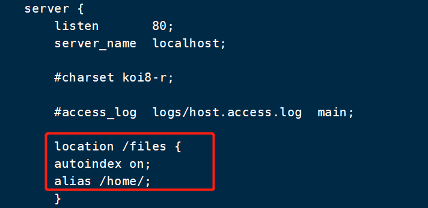
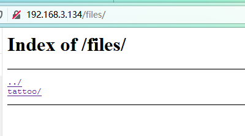
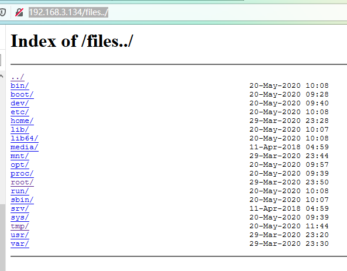
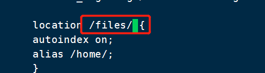

# nginx目录穿越

Nginx在配置别名(Alias)的时候,如果忘记加/,将造成一个目录穿越漏洞。

**复现**

修改nginx.conf配置文件

在如下配置中设置目录别名时/files配置为/home/的别名,那么当我们访问/files../时,nginx实际处理的路径时/home/../,从而实现了穿越目录。



访问

```
http://192.168.3.134/files/
```



再访问，成功实现目录穿越

```
http://192.168.3.134/files../
```



**修复**

配置别名(Alias)的时候最后记得加 / 

