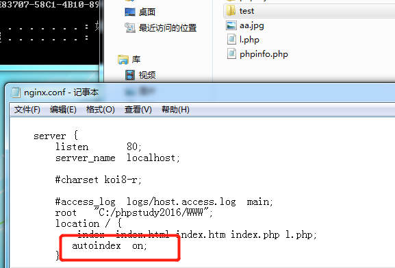
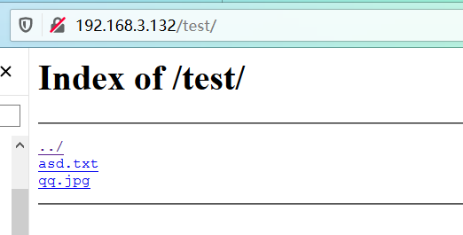

# nginx目录遍历

1. 目录遍历

也是nginx配置文件配置错误导致的漏洞

**复现**

修改nginx.conf文件，autoindex为on，重启服务器

```conf
server {
        listen       80;
        server_name  localhost;

        #charset koi8-r;

        #access_log  logs/host.access.log  main;
        root   "C:/phpstudy2016/WWW";
        location / {
            index  index.html index.htm index.php l.php;
           autoindex  on;
        }
```



访问test目录



修复：autoindex改为off