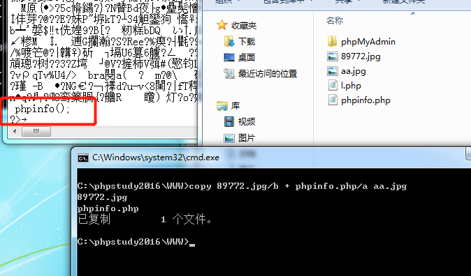
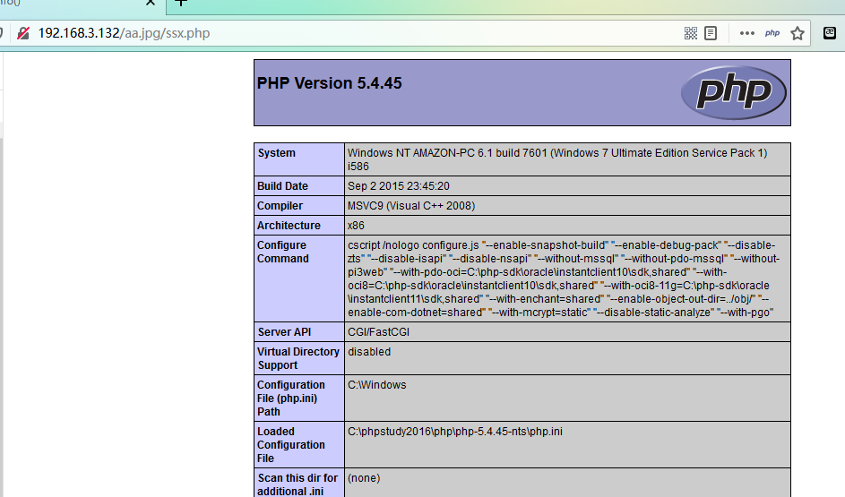

# Nginx解析漏洞

1. 文件解析漏洞

对任意文件名，在后面添加/任意文件名.php，即可解析成php。

比如原本文件名是test.jpg，可以添加test.jpg/x.php进行解析攻击。

```
test.jpg/x.php
```

**复现**

制作一个图片与php代码合并的图片aa.jpg

				

首先访问aa.jpg，正常显示


通过解析漏洞使其解析成php，在后面加

```
/ssx.php
```



