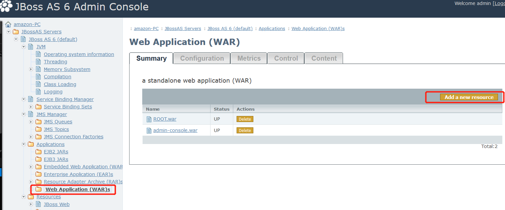

# jBoss--war后门文件部署

jBoss后台管理页面存在弱口令，通过爆破获得账号密码。登陆后台上传包含后门的war包。

与tomcat存在一样的漏洞

进入管理员控制面板

这里可以通过爆破弱口令进入后台，响应会比较慢

打开Web Application (WAR)s选项卡，添加资源Add a new resource，并上传war包

上传成功，还需要进去开启部署这个项目

**修复**

1. 避免使用弱口令

2. 使用低权限运行jBoss