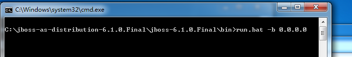
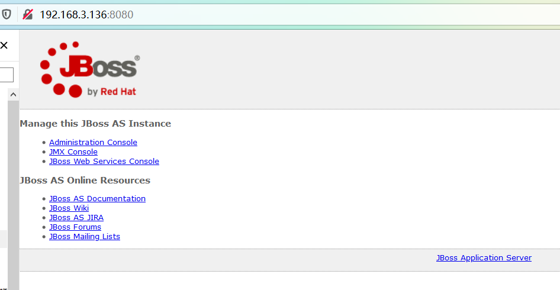
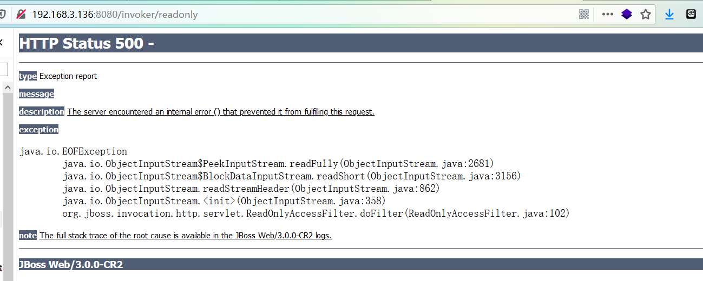
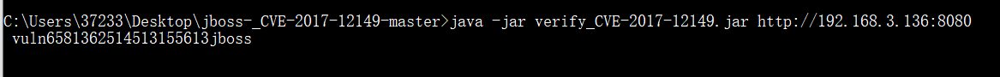
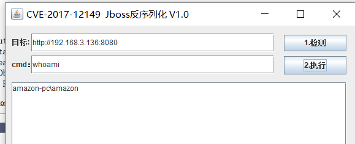
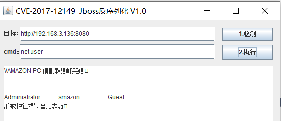

# jBoss反序列化漏洞

java序列化，简而言之就是把java对象转化为字节序列的过程。而反序列话则是再把字节序列恢复为java对象的过程，然而就在这一转一变得过程中，程序员的过滤不严格，就可以导致恶意构造的代码的实现。

**原理：**直接从http中获取数据，在没有进行检查或者过滤的情况下，尝试调用readobject()方法对数据流进行反序列操作，因此产生了Java反序列化漏洞。

**影响版本：**jBossAS 5.x，6.x

**复现**

搭建jBoss-6.1.0环境

```
run.bat -b 0.0.0.0
```





验证是否存在漏洞，访问 192.168.3.136:8080/invoker/readonly，出现以下页面说明存在反序列化漏洞



工具验证方法

```
java -jar verify_CVE-2017-12149.jar http://192.168.3.136:8080
```



利用工具直接执行命令





**修复**

1. 升级到jBoss AS7版本

2. http-invoker.sar 组件不需要可直接删除

3. 在 http-invoker.sar下 web.xml 的security-constraint 标签中：添加对 http invoker 组件进行访问控制。

```
<url-pattern>/*</url-pattern>
```

