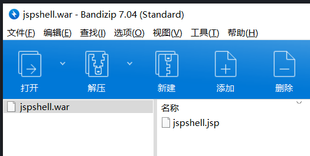

# tomcat--war后门文件部署

Tomcat 支持在后台部署war文件，可以直接将webshell部署到web目录下。

若后台管理页面存在弱口令，则可以通过爆破获取密码。


**复现**

进入后台管理页面 ，需要用户名和密码，这里可以通过爆破弱口令进入

然而tomcat的配置文档写了，它没有默认用户和密码，需要自己去/conf/tomcat-users.xml文件里面设置


所以这里跳过爆破，展示配置文件，弱口令tomcat/tomcat


进入后找到上传点


上传war包文件，运行自己的部署，把jsp文件打包成zip，改后缀为war

**war包：**war是一个可以直接运行的web模块，通常用于网站，打成包部署到容器中。一个war包可以理解为是一个web项目，里面是项目的所有东西。



上传一个war包，里面是jsp后门


上传成功后，会自动将war包解压并运行，路径为

```
war包名称/里面的jsp文件
例：jspshell/jspshell.jsp
```


访问 192.168.3.135:8080/jspshell/jspshell.jsp 通过post请求发送报文执行命令


成功解析


**使用msf的multi/http/tomcat_mgr_upload模块可以反弹shell**


**修复：**

1. 后台管理页面避免弱口令
2. 创建低权限用户运行tomcat，该用户只拥有一组最小权限
3. 增加对于本地和基于证书的身份验证，部署账户锁定机制。在CATALINA_HOME/conf/web.xml文件设置锁定机制和时间超时限制
4. 针对manager-gui/manager-status/manager-script等目录页面设置最小权限访问限制

